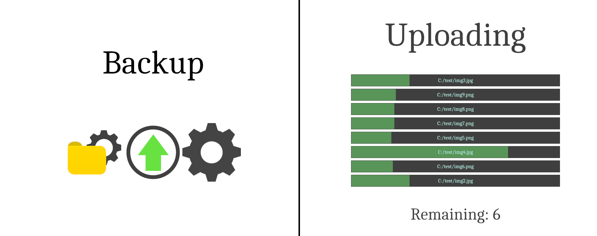
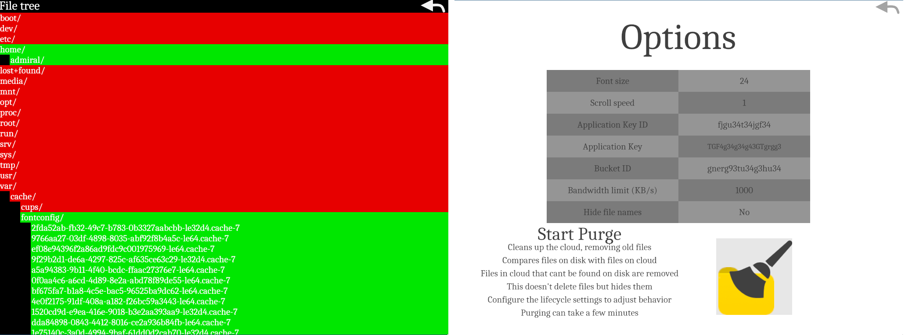
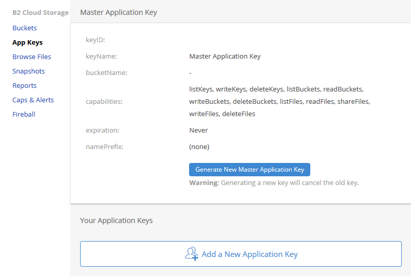
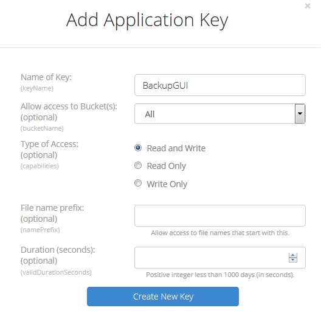
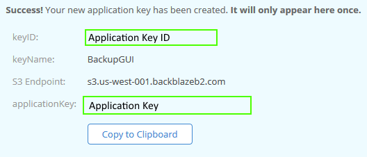
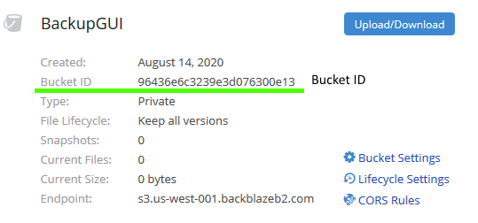

# Backup GUI
A functioning backup tool with a GUI, written in Rust for the Backblaze's B2 Cloud Storage.  
Note that this is a backup tool - it does not provide any synchronization or downloading of the files. 
If you need to retrieve files, use the [web interface](https://secure.backblaze.com/user_signin.htm).

## Screenshots

## Requirements
Requires a Vulkan driver on your system.   
This should already be present on Windows, but you may need to install the package for your Linux distro.

You'll also need an account on Backblaze. See https://www.backblaze.com/b2/cloud-storage.html for signup and pricing.

## Usage
Before you can use the program, it must be configured. Go into the options menu and refer to [Setup](#setup)

The main menu features 3 buttons, from left-to-right: file-tree, upload and options.  
Before you can start uploading files, make sure the options are set correctly.  

You need to go into the file-tree and select which files you want to upload.  
Left click expands/collapses an entry, right click toggles whether it should be uploaded.   
Red = exclude, green = include.

Once this is done, simply hit the upload button in the main menu, and it'll start uploading the files.

The options menu has a button to start a "purge". This will get rid of files in the cloud that aren't present on the drive. 
This effectively saves space, resulting in lower cost by not storing useless files.  
Note that purging does not immediately remove the files, it "hides" them, meaning what exactly happens depends on your lifecycle rules.
See [here](https://www.backblaze.com/b2/docs/lifecycle_rules.html) for details. 

## Setup
You'll need to do a bit of setup in Backblaze before you can use this program.  
First you should create a bucket, then you should generate a new app key. 
It it suggested that you change the lifecycle settings of the bucket to " Keep prior versions for this number of days".

You'll need to generate a new application key. Go into 'App Keys' and press 'Add a New Application Key'

  
You can give the key a name and optionally make it only work for your new bucket and more. 

Now you're presented with the app key secret:
  
Note that the 'applicationKey' will only be shown once. If you lose it, you need to make a new key.

Lastly you need to grab the ID of the bucket you created, which can be read in the menu:

## Disclaimer
This project is not associated with Backblaze. Use at your own risk. See License.md.    
